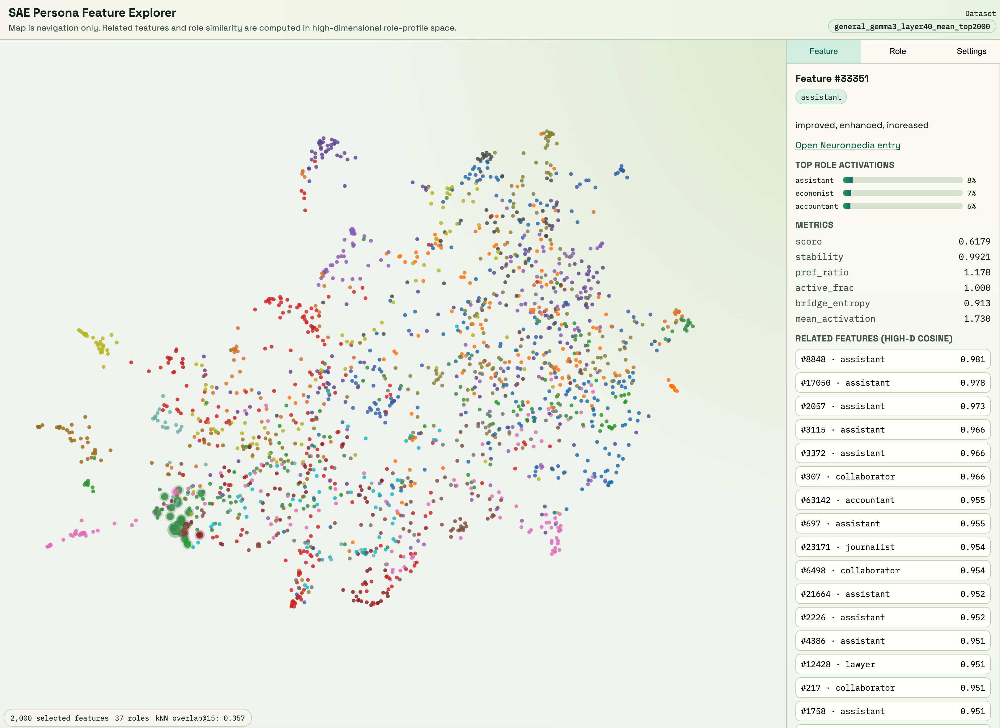

# Interpret Personas

<p align="center">
  <a href="https://ayseasude.github.io/interpret-personas/">
    
  </a>
</p>

<p align="center">
  
</p>

Map which SAE (Sparse Autoencoder) features activate under which personas. Given 276 roles, this pipeline generates role-prompted LLM responses, extracts interpretable SAE features from those responses, and aggregates them into per-role feature vectors.

## How It Works

The pipeline has three stages that run sequentially:

```
  ┌──────────────┐     ┌──────────────────┐     ┌──────────────┐
  │  1. Generate │────▶│  2. Extract      │────▶│  3. Aggregate│
  │  Responses   │     │  SAE Features    │     │  Per Role    │
  └──────────────┘     └──────────────────┘     └──────────────┘

  276 roles             Run each response        Combine all responses
  × 5 prompts           through the model         for a role into a
  × 240 questions        with an SAE attached      single feature vector
  = 331,200 responses    to extract features
```

The final output is a matrix of shape `[276 roles, 65536 SAE features]` where each cell tells you how strongly a given feature activates for a given persona.

---

## Stage 1: Generate Responses

**Goal:** Get the model to respond to questions while role-playing each persona.

**What happens:**

Each of the 276 roles (e.g., "analyst", "philosopher", "doctor") has 5 different instruction variants &mdash; different ways of phrasing the same role assignment.

```
Role: analyst
  Variant 0: "You are an analyst who specializes in examining complex data sets..."
  Variant 1: "Act as an analyst with extensive experience in statistical analysis..."
  Variant 2: "Please be an analyst who systematically breaks down information..."
  ...
```

For each role, every instruction variant is paired with every question from a set of 240 general questions (covering ethics, technical topics, social scenarios, etc.). The model generates a response for each combination.

```
For each role (276):
  For each instruction variant (5):
    For each question (240):
      → Generate one response
```

Responses are generated in batch using [vLLM](https://github.com/vllm-project/vllm) and saved as one JSONL file per role.

**Output:** `outputs/responses/{question_mode}/{model_name}/{role}.jsonl`

Each line contains the system prompt, question, response text, and the full conversation in chat format.

---

### Stage 2: Extract SAE Features

**Goal:** Turn each response into a vector of interpretable feature activations.

**What happens:**

```
                    ┌────────────────────────────────────┐
                    │          Language Model            │
  conversation ────▶│  ┌───────────┐     ┌────────────┐  │
  (system prompt    │  │  Layer 40 │────▶│    SAE     │  │───▶ feature activations
   + question       │  │  residual │     │  (65,536   │  │     [n_tokens, 65536]
   + response)      │  │  stream   │     │  features) │  │
                    │  └───────────┘     └────────────┘  │
                    └────────────────────────────────────┘
```

1. The full conversation (system prompt + question + response) is fed through the language model.
2. At layer 40, the SAE intercepts the residual stream activations.
3. The SAE decomposes these activations into 65,536 sparse features, producing one feature vector per token.

**Token selection:** By default, only tokens from the assistant's response are kept (`response_only` mode).

**Per-response aggregation:** The per-token feature vectors are reduced to a single vector per response using both mean and max pooling across tokens.

```
Token features:  [n_tokens, 65536]
                        │
        ┌───────────────┼───────────────┐
        ▼                               ▼
  mean over tokens                max over tokens
  [1, 65536]                      [1, 65536]
```

Both are saved.

**Output per role:**
- `{role}.npz` &mdash; compressed numpy arrays (`mean_features`, `max_features`), shape `[n_responses, 65536]`
- `{role}.jsonl` &mdash; metadata (role, question, response text, etc.) without feature data

---

### Stage 3: Aggregate to Role Level

**Goal:** Collapse all responses for a role into a single feature vector that represents that persona.

Each role has up to 1,200 responses (5 instruction variants &times; 240 questions). This stage aggregates them down to one vector per role.

```
Per-response features:   [1200, 65536]   (one role)
                              │
              ┌───────────────┼───────────────┐
              ▼                               ▼
        mean over responses             max over responses
        [1, 65536]                      [1, 65536]
```

This is done for all 276 roles, producing the final output:

```
Per-role features:   [276, 65536]
Role names:          [276]
```

**Output:** `outputs/aggregated/{strategy}/per_role.npz`

One file per aggregation strategy (mean, max), each containing a `features` array and a `role_names` array.

---

## Data

Role definitions and questions are taken from [assistant-axis](https://github.com/safety-research/assistant-axis/) ([paper](https://arxiv.org/abs/2601.10387)).

### Roles

276 role files in `data/roles/instructions/`, each containing:

- **5 instruction variants** &mdash; different phrasings of the role assignment (used as system prompts)
- **Role-specific questions** &mdash; questions tailored to the role (not used in the default `general` question mode)

Roles span a wide range: analyst, doctor, philosopher, activist, accountant, absurdist, and more.

### Questions

240 general questions in `data/extraction_questions.jsonl`, covering diverse topics:

- Ethics and morality
- Technical explanations
- Social and interpersonal scenarios
- Business and practical decisions

---

## Output Structure

```
outputs/
├── responses/
│   └── general/
│       └── gemma-3-27b-it/
│           ├── analyst.jsonl          # 1,200 responses
│           ├── philosopher.jsonl
│           └── ...                    # 276 files
├── features/
│   └── general/
│       └── gemma-3-27b-it_layer_40_width_65k_l0_medium/
│           ├── analyst.npz            # feature arrays
│           ├── analyst.jsonl          # metadata
│           └── ...                    # 276 × 2 files
└── aggregated/
    └── general/
        └── gemma-3-27b-it_layer_40_width_65k_l0_medium/
            ├── mean/
            │   └── per_role.npz       # [276, 65536]
            └── max/
                └── per_role.npz       # [276, 65536]
```

---

## Setup

### Clone the repository
git clone https://github.com/AyseAsude/interpret-personas.git
cd interpret-personas

### Install with uv

```bash
# Extraction and aggregation only (no vLLM)
uv pip install -e .

# Full pipeline including response generation
uv pip install -e ".[generation]"

# Visualization bundle build dependencies (UMAP + plotting stack)
uv pip install -e ".[visualization]"
```

## Usage

Each stage is configured via a YAML file in `configs/`. Edit these to change models, paths, or parameters.

### 1. Generate responses

```bash
python pipeline/1_generate.py --config configs/generation.yaml
```

Use `--skip-existing` to resume after interruption (skips roles that already have output files). Use `--roles` to run only for selected roles (e.g., `--roles analyst philosopher doctor`).

### 2. Extract SAE features

```bash
python pipeline/2_extract_features.py --config configs/extraction.yaml
```

Supports `--skip-existing` and `--roles` (same as stage 1).

### 3. Aggregate features

```bash
python pipeline/3_aggregate.py --config configs/aggregation.yaml
```

### 4. Build visualization bundle

```bash
python pipeline/4_build_viz_bundle.py --config configs/visualization.yaml
```

This creates:

- `outputs/viz_bundle/{dataset_name}/bundle.json` (frontend data bundle)
- `outputs/viz_bundle/{dataset_name}/features.csv` (flat feature table for exporting)

The bundle includes selected feature metadata, UMAP/PCA coordinates, high-D cosine neighbors,
role-role similarity, and a neighborhood preservation score.

### 4.5. Fetch Neuronpedia descriptions (optional, cached)

This step fetches descriptions for selected features from:

`https://neuronpedia.org/api/feature/{neuronpedia_id}/{feature_id}`

Example (Gemma 3 27B layer-40 Gemmascope release):

```bash
python pipeline/5_fetch_neuronpedia_cache.py \
  --bundle-file outputs/viz_bundle/general_gemma3_layer40_mean_top5000/bundle.json \
  --neuronpedia-id gemma-3-27b-it/40-gemmascope-2-res-65k \
  --output-cache data/neuronpedia_cache.json
```

Then point visualization config to that cache and rebuild bundle:

```yaml
# configs/visualization.yaml
description_cache: "data/neuronpedia_cache.json"
```

```bash
python pipeline/4_build_viz_bundle.py --config configs/visualization.yaml
```

### 5. Run the interactive explorer

The frontend lives in:

`apps/sae-persona-explorer`

Serve `bundle.json` to the app root (or set `VITE_BUNDLE_URL` to a custom path), then run:

```bash
npm run dev
```

## Configuration

### `configs/generation.yaml`

| Parameter | Default | Description |
|---|---|---|
| `model_name` | `google/gemma-3-27b-it` | HuggingFace model ID for response generation |
| `question_mode` | `general` | `general` (shared questions) or `role_specific` (per-role questions) |
| `prompt_indices` | `[0,1,2,3,4]` | Which instruction variants to use (0-indexed) |
| `temperature` | `0.7` | Sampling temperature |
| `max_tokens` | `512` | Max response length |
| `max_model_len` | `2048` | vLLM context window |

### `configs/extraction.yaml`

| Parameter | Default | Description |
|---|---|---|
| `model_name` | `google/gemma-3-27b-it` | Model to run extraction through |
| `sae_release` | `gemma-scope-2-27b-it-resid_post` | SAE model release identifier |
| `sae_id` | `layer_40_width_65k_l0_medium` | Specific SAE: layer, width, and sparsity |
| `token_selection` | `response_only` | `response_only` or `all` (which tokens to extract features from) |

### `configs/aggregation.yaml`

| Parameter | Description |
|---|---|
| `features_dir` | Path to per-role feature files from extraction |
| `output_dir` | Where to write aggregated outputs |

## Built On

- [SAELens](https://github.com/jbloomAus/SAELens) &mdash; SAE loading and inference
- [vLLM](https://github.com/vllm-project/vllm) &mdash; batch inference (optional, generation stage only)
